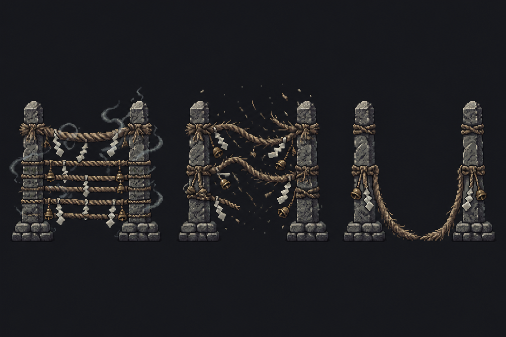
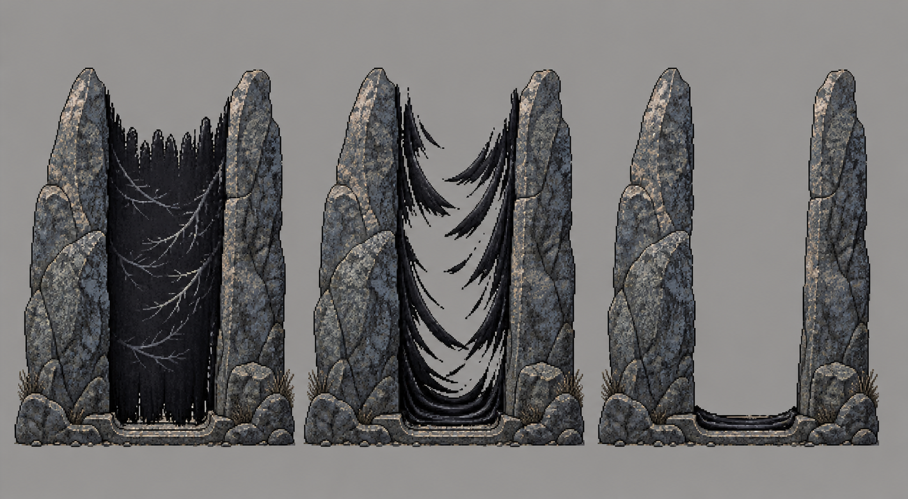
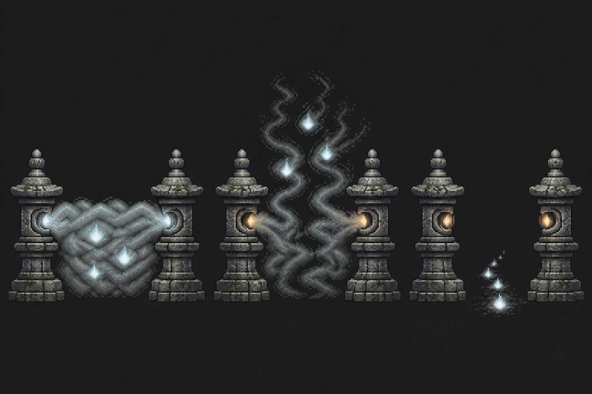
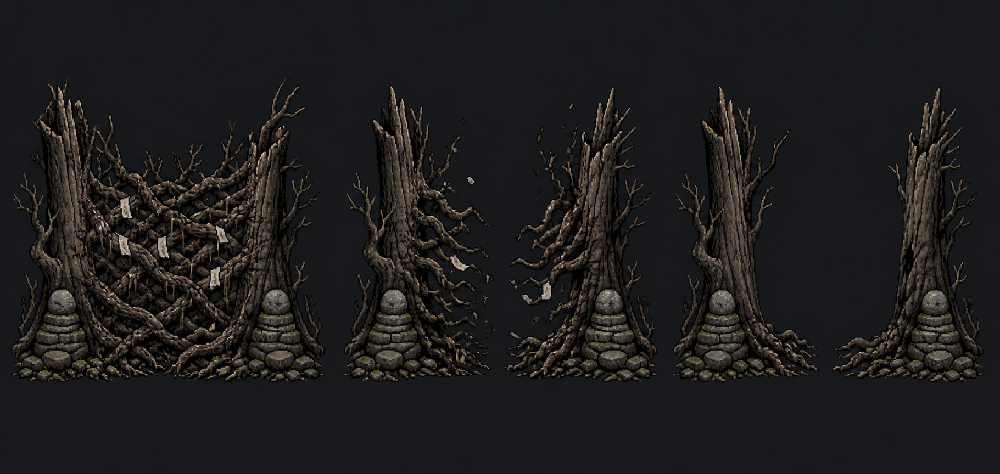

# 결계·통과문 완전 신규 후보 4안 (2026-08-22)

## 결정 상태

- 기존 `gate_barrier.png`의 빛기둥·세로 부적줄과 `level_exit_gate.png`의 일반 한옥문 컨셉은 폐기 대상으로 본다.
- 아래 이미지는 **방향 선택용 고해상도 컨셉 시안**이다. 아직 런타임 에셋이나 코드에는 적용하지 않았다.
- 각 시트는 왼쪽부터 `봉인 → 해제 중 → 통과 가능` 상태다.
- 선택 후 해당 안만 투명 배경의 실제 게임 규격으로 다시 만들고, 6~8프레임 해제 애니메이션으로 다듬는다.

## 후보 비교

### A. 금줄 경계석



- 장점: 조선 마을의 금기 경계라는 의미가 즉시 읽히며 가장 토속적이다.
- 장점: 기둥은 그대로 두고 금줄만 풀면 되어 실제 애니메이션 구현이 안정적이다.
- 주의: 봉인 상태가 울타리처럼 보여 진행 방향 표식은 B·C보다 약할 수 있다.

### B. 먹 장막 바위문 — 1순위 권장



- 장점: 수묵·한지 톤과 가장 직접적으로 결합하며 기존 결계와 실루엣이 완전히 다르다.
- 장점: 검은 장막이 바닥 홈으로 빨려 들어가며 같은 자리에 길이 드러나는 전환이 명확하다.
- 주의: 검은 장막이 너무 커지면 화면을 무겁게 하므로 실제 에셋은 폭과 명도를 줄여야 한다.

### C. 혼불 석등길 — 가독성 1순위



- 장점: 봉인과 열린 길의 차이가 가장 빨리 읽히고, 열린 뒤 혼불이 다음 굽이 방향을 안내한다.
- 장점: 전투 종료 보상 연출과 소리의 연결이 쉽다.
- 주의: 양식이 일본 석등처럼 보이지 않도록 실제 제작 시 조선 석등 비례를 더 엄격히 고정해야 한다.

### D. 당산목 뿌리문



- 장점: 가장 오래되고 불길한 분위기이며 보스 앞 특수 결계로 특히 강하다.
- 장점: 뿌리가 양쪽으로 물러나는 해제 동작이 물리적으로 납득된다.
- 주의: 폭이 넓고 디테일이 많아 일반 굽이마다 반복하면 배경과 전투 대상을 가릴 수 있다.

## 권장 적용 방식

1. 전체 스테이지의 공통 통과문은 B 또는 C 중 하나로 통일한다.
2. A는 민가·마을, D는 보스·사당 앞의 변형 결계로 나중에 분화할 수 있다.
3. 봉인과 출구를 별도 그림으로 페이드 교체하지 않고, 하나의 구조가 실제로 해제되는 애니메이션으로 만든다.
4. 최종 시트는 Nearest 필터, 제한 팔레트, 투명 배경, 바닥 기준점 고정으로 제작한다.

## 생성 방식

- 도구: Codex 내장 고품질 이미지 생성기
- 분류: `stylized-concept`
- 입력 이미지: 없음. 기존 에셋을 참조하지 않은 완전 신규 생성.
- 공통 금지: 빛기둥, 세로 부적줄, 일반 기와 대문, 원형 포탈, 도리이, 패루, 서양 룬, 네온, 워터마크.

## 최종 프롬프트 세트

### A

```text
Use case: stylized-concept
Asset type: game environment gate concept sheet for a 2D side-scrolling action RPG
Primary request: an entirely original Joseon Korean supernatural passage design, Candidate A, based on a village taboo boundary rather than a magical portal. Show exactly three sequential states left-to-right: SEALED, RELEASING, PASSABLE.
Subject: two weathered low Korean granite boundary posts with a thick hand-braided geumjul straw rope stretched between them; small plain white mulberry-paper streamers and tiny brass bells are tied to the rope. Sealed state: the rope is taut and several horizontal rope strands block the path, paper streamers flutter with restrained pale spirit breath. Releasing state: rope fibers loosen and lift as ash-like flecks, bells swing, no explosion. Passable state: the rope hangs slack and low at both posts, leaving a clearly empty walkable gap while the two posts remain as the destination marker.
Style/medium: premium hand-crafted 16-bit pixel art concept sheet, crisp deliberate pixel clusters, limited 24-color palette, Joseon folk-horror restraint, production-quality game sprite design
Composition/framing: orthographic side view, three equal cells in one horizontal row, each full structure centered and fully visible, identical scale and camera, readable beside a 48-pixel-tall player, no perspective floor, generous separation
Lighting/mood: cold moonlit charcoal and hanji gray, tiny muted brass and off-white accents, somber and uncanny rather than flashy
Materials/textures: worn Korean granite, dry twisted rice straw, fibrous hanji, tarnished brass
Constraints: original design; Korean forms only; no existing-game references; no text or labels; no character; no scenery; no watermark
Avoid: vertical beam of light, stacked talisman chain, conventional roofed gate, circular portal, torii, shimenawa, Chinese paifang, Japanese motifs, Western runes, neon blue, high fantasy ornament, smooth vector art, anti-aliased edges
```

### B

```text
Use case: stylized-concept
Asset type: game environment gate concept sheet for a 2D side-scrolling action RPG
Primary request: an entirely original Joseon Korean supernatural passage design, Candidate B, a natural stone threshold sealed by living ink. Show exactly three sequential states left-to-right: SEALED, RELEASING, PASSABLE.
Subject: two uneven upright slabs of native Korean granite forming a narrow mountain threshold, with no roof and no architecture. Sealed state: the gap is filled by one dense vertical curtain of matte black sumi ink with ragged brush edges, crossed by faint pale crack lines shaped like wind through pine needles; no written symbols. Releasing state: the ink curtain peels inward in long dry-brush ribbons and sinks into a shallow carved groove at the base. Passable state: the center is completely empty and walkable; only the two granite slabs and a thin dormant black ink pool remain, creating a clear destination silhouette.
Style/medium: premium hand-crafted 16-bit pixel art concept sheet, crisp hard-edged pixel clusters, limited 24-color palette, subdued sumukhwa and hanji sensibility, production-quality game sprite design
Composition/framing: orthographic side view, three equal cells in one horizontal row, identical scale and camera, entire structures visible, readable beside a 48-pixel-tall player, no perspective floor
Lighting/mood: quiet predawn, stone blue-gray, dry ink black, very restrained warm gray rim light, eerie and dignified
Materials/textures: rough Korean granite, mineral lichen, dry matte ink, shallow worn stone groove
Constraints: original design; Korean natural landscape language only; no text, calligraphy, labels, characters, scenery, or watermark
Avoid: talismans, vertical light beam, roofed gate, circular portal, torii, Chinese monumental gate, Japanese shrine imagery, glowing runes, neon, high fantasy crystals, smooth painterly gradients, anti-aliasing
```

### C

```text
Use case: stylized-concept
Asset type: game environment gate concept sheet for a 2D side-scrolling action RPG
Primary request: an entirely original Joseon Korean supernatural passage design, Candidate C, a spirit road revealed by Korean stone lanterns. Show exactly three sequential states left-to-right: SEALED, RELEASING, PASSABLE.
Subject: a matched but slightly weathered pair of compact Korean seokdeung stone lanterns standing on either side of a narrow path, without any roofed gate. Sealed state: their inner-facing lamp openings exhale opposing streams of low white soul-mist that meet in the center as a thick opaque braided fog wall, with three dim will-o-wisps trapped inside. Releasing state: the fog braid unravels upward into separate wisps and the lantern apertures warm faintly. Passable state: the center is fully empty; a short trail of small ground-level white-blue will-o-wisps recedes through the gap, clearly inviting forward movement, while the lanterns remain as a marker.
Style/medium: premium hand-crafted 16-bit pixel art concept sheet, crisp controlled pixel clusters, limited 24-color palette, Joseon ghost-story restraint, production-quality game sprite design
Composition/framing: orthographic side view, three equal cells left-to-right, identical structure scale and camera, full silhouette centered in each cell, readable beside a 48-pixel player, no perspective floor or background scenery
Lighting/mood: charcoal dusk, pale bone-gray granite, muted white-blue spirit flame, one subtle amber point after release, contemplative not spectacular
Materials/textures: worn carved granite, moss specks, soft granular mist rendered as pixel clusters
Constraints: original Korean design; no text or labels; no characters; no scenery; no watermark
Avoid: talismans, light pillars, conventional door, roofed gate, circular portal, torii, Chinese lanterns, Japanese lantern silhouette, Western gravestones, neon cyan, excessive bloom, high fantasy magic circles, anti-aliased edges
```

### D

```text
Use case: stylized-concept
Asset type: game environment gate concept sheet for a 2D side-scrolling action RPG
Primary request: an entirely original Joseon Korean supernatural passage design, Candidate D, a sacred village tree-root threshold. Show exactly three sequential states left-to-right: SEALED, RELEASING, PASSABLE.
Subject: two old dark fragments of a Korean dangsan sacred tree rooted on opposite sides of the path, their trunks cut and storm-broken so there is no leafy canopy. Sealed state: thick living roots and bare branches interlock across the center like a dense woven knot, with a few small unmarked white hanji strips caught among the twigs and one weathered doltap stone pile at each base. Releasing state: the roots slowly withdraw to both sides, shedding dry bark and muted charcoal motes. Passable state: roots lie curled beside the bases and the central gap is completely open, framed by the two broken trunks and low stone piles.
Style/medium: premium hand-crafted 16-bit pixel art concept sheet, crisp hard pixel clusters, limited 24-color palette, restrained Korean folk-horror and sumukhwa mood, production-quality game sprite design
Composition/framing: orthographic side view, exactly three equal cells in one horizontal row, identical scale and camera, full structures centered and fully visible, readable beside a 48-pixel-tall player, no perspective floor
Lighting/mood: moonless charcoal-gray night, dry brown-black wood, pale hanji, tiny desaturated moss accents, ancient and ominous without gore
Materials/textures: cracked old bark, exposed roots, stacked native fieldstone, torn fibrous paper
Constraints: original design; Korean village guardian-tree language only; no text, labels, characters, scenery, or watermark
Avoid: vertical light beam, talisman chain, roofed gate, circular portal, torii, shimenawa, Chinese/Japanese sacred-tree ornaments, faces carved into trees, neon, fantasy crystals, lush colorful foliage, smooth vector art, anti-aliasing
```
